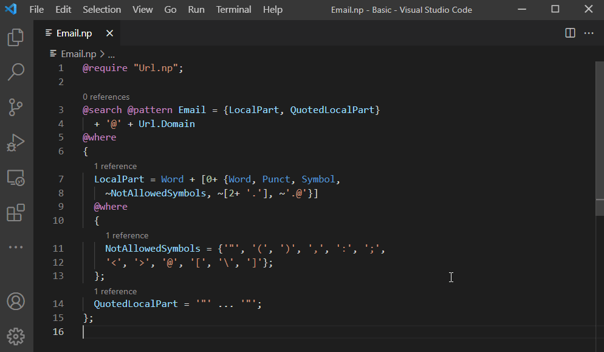
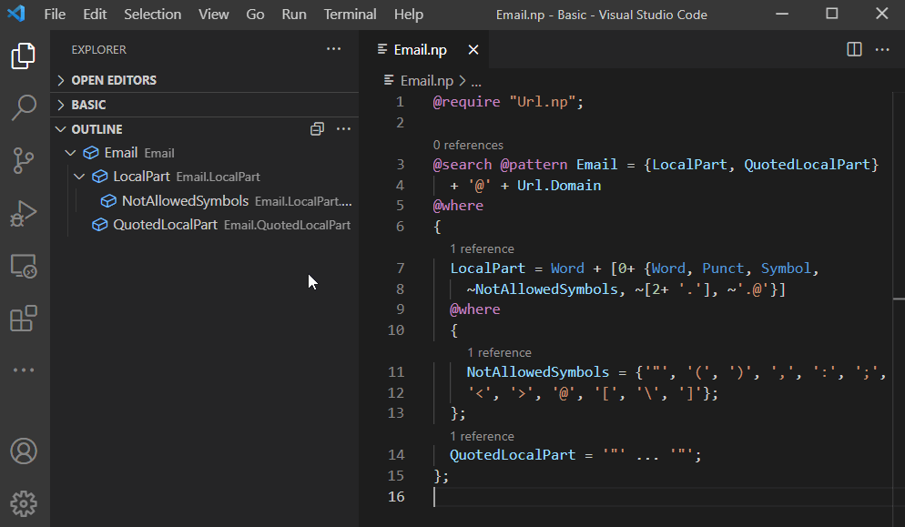
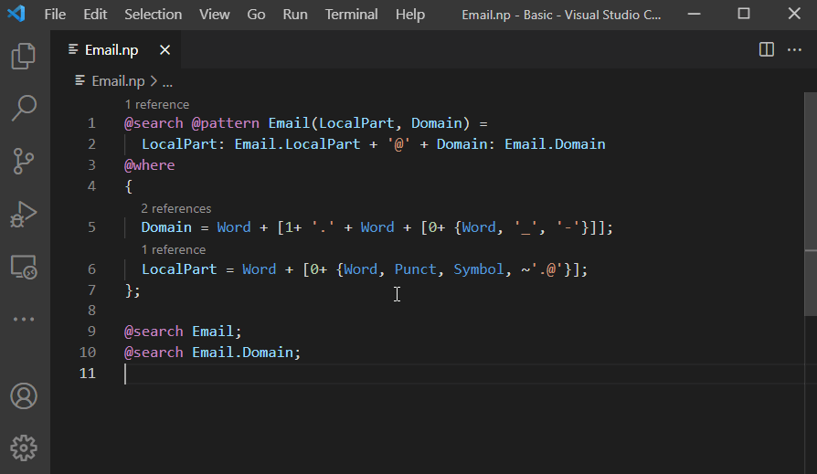
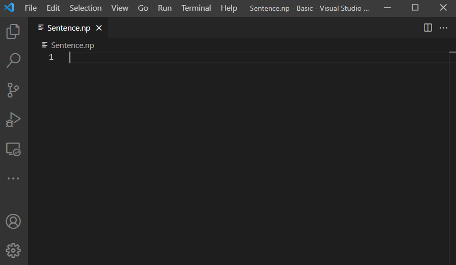
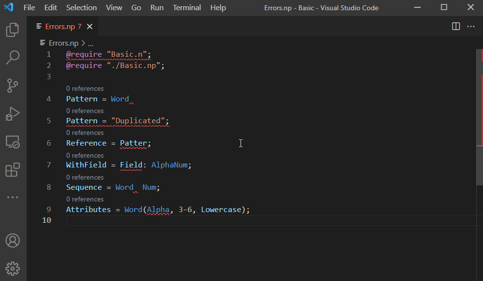

# Nevod VSCode Extension

This is an [open-source](https://github.com/nezaboodka/nevod-vscode) Visual Studio Code extension for [Nevod](https://github.com/nezaboodka/nevod) language aimed at pattern-based text search. 
- Official website for Nevod technology: https://nevod.io/
- Nevod Language Tutorial: https://nevod.io/#/tutorial
- Nevod Language Reference: https://nevod.io/#/reference
- Playground: https://nevod.io/#/playground

## Basic features

**Syntax highlighting** - improves readability of patterns by distinguish between keywords, identifiers, text literals, operators, and other tokens.

**Go to Definition / Go to References**. Definition or references can be located either in the same or in the required file. Reference count is shown in CodeLens above every pattern.

**Go to Symbol in Editor...**. Allows navigation to a desired pattern written in Nevod language. Use `Ctrl+Shift+O` key combination to navigate within the current file, and `Ctrl+T` key combination to navigate across all files in the opened directory.

**Outline** - shows the outline view of the pattern tree of the currently active file.

**Rename Symbol / Change All Occurrences**.

**Code Completion** includes: keywords, tokens, pattern names, namespaces, field names, tokens and text attributes, file paths. 
  Pattern, namespace and field completions depend on scope. If pattern can be referenced in different ways (e.g. with and without namespace), the shortest variant is suggested to avoid name conflicts. Already written text is taken into account when filtering completion items. If completion suggestions do not pop up automatically, use `Ctrl+Space` to trigger them.

**Diagnostics**. Two types of errors are displayed: syntax errors (operator expected, pattern should end with semicolon, etc.) and linking errors (reference to undefined pattern, undeclared field, etc.). Hover over an underlined text to see error message. Use `Ctrl+Shift+M` to open Problems panel and see error summary. Use `F8` or `Shift+F8` keys to loop through errors in the current file.

## Installation

Nevod VS Code extension is available at [Visual Studio Code Marketplace](https://marketplace.visualstudio.com/items?itemName=nezaboodka.nevod-vscode-extension).

There are [example patterns](source/example/Basic.np) to try this extension. Files with the `.np` extension are automatically recognized as Nevod packages.

## License

Nevod VSCode Extension is licensed under [Apache 2.0](LICENSE).
