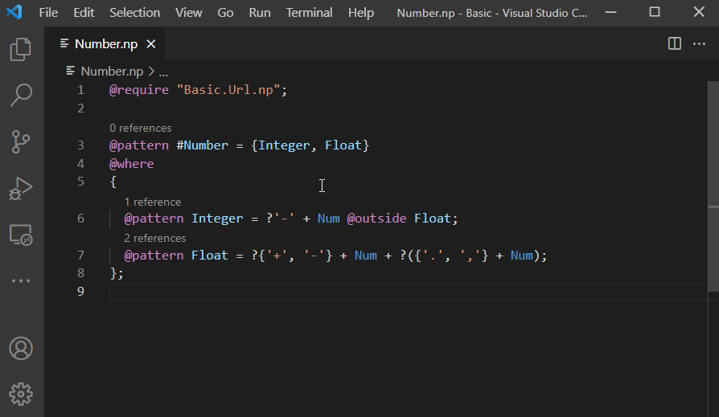

# Nevod VSCode Extension

Visual Studio Code extension for [Nevod](https://github.com/nezaboodka/nevod) language.
- Official Website: https://nevod.io/
- Language Tutorial: https://nevod.io/#/tutorial
- Language Reference: https://nevod.io/#/reference
- Playground: https://nevod.io/#/playground

## Basic features

- **Syntax highlighting**. Highlighting helps you to distinguish between tokens of different types.
- **Go to definition / references**. You can go to the definition of a pattern or a field by pressing `F12` (`Shift+F12` to go to references). You can also use `Ctrl+Click`. Definition or references can be located either in the same or in required file. Reference count is shown in CodeLens above every pattern.
  
- **Get document and workspace symbols**. In Nevod language symbols are represented by patterns. You can navigate symbols inside a file with `Ctrl+Shift+O`. To navigate symbols across all files in opened directory use `Ctrl+T`. Start typing pattern name, press `Up` and `Down` keys to choose the desired pattern and press `Enter` to navigate to it. Displayed information about patterns includes master pattern name.
  
- **Outline**. The Outline view shows the pattern tree of currently active editor.
  
- **Rename symbol**. You can rename patterns and fields. Press `F12`, input new desired name and press `Enter` to apply rename edits. Definition and references across all files will be renamed.
  
- **Code completion**. Completion includes:
  - Keywords
  - Tokens
  - Pattern names
  - Namespaces
  - Field names
  - Token and text attributes
  - File paths

  Pattern, namespace and field completions depend on scope. If pattern can be referenced in different ways (e.g. with and without namespace), the shortest variant is suggested avoiding name conflicts. Already written text is taken into account when filtering completion items. If completion suggestions do not pop up automatically, use `Ctrl+Space` to trigger them. 
  
- **Diagnostics**. Two types of errors are displayed: syntax errors (operator expected, pattern should end with semicolon, etc.) and linking errors (reference to undefined pattern, undeclared field, etc.). Hover over an underlined text to see error message. You can use `Ctrl+Shift+M` to open Problems panel and see error summary. To loop through errors in the current file press `F8` or `Shift+F8`.
  

## Get started

- **Step 1.** Install Nevod extension from [Visual Studio Code Marketplace](https://marketplace.visualstudio.com/items?itemName=nezaboodka.nevod-vscode-extension).
- **Step 2.** Open folder with Nevod patterns or create new file with `.np` extension.
- **Step 3.** Write patterns.

## License

Nevod VSCode Extension is licensed under [Apache 2.0](LICENSE).
